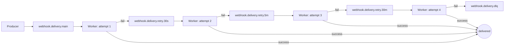
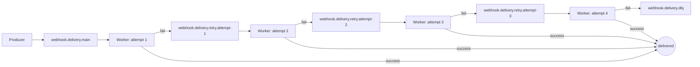
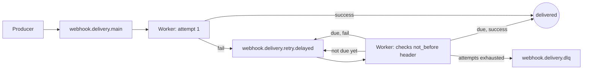
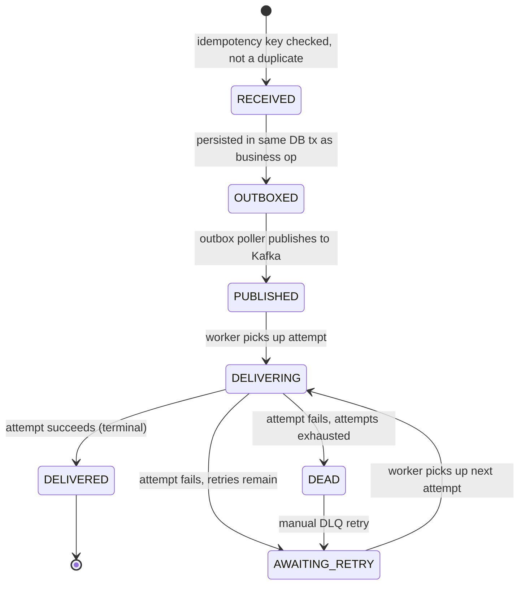

# PROTOTYPE — state machine & retry-topology sketch

Throwaway. Answers wayfinder ticket [#2 "State-machine & retry-topology sketch"](https://github.com/luizwalber/reliable-webhooks/issues/2), part of map [#1](https://github.com/luizwalber/reliable-webhooks/issues/1). Feeds the later grilling tickets [#9 "Retry policy & topic topology"](https://github.com/luizwalber/reliable-webhooks/issues/9) and [#10 "Event/attempt state machine"](https://github.com/luizwalber/reliable-webhooks/issues/10) — this sketch raises fidelity, it does not lock the ADR.

## Question

Sketch 2-3 candidate event/attempt state machines and retry-topic layouts to react against. Fixed by the brief and NOT reopened here: at-least-once delivery, idempotency dedup, transactional outbox, Kafka main + staggered retry topics + DLQ, exponential backoff + jitter, max-attempt limit, per-endpoint circuit breaker, HMAC signatures, `docker-compose up` in one command.

## Run it

```
node prototypes/wf2-state-machine-retry-topology/tui.js
```

No dependencies — plain Node.js. Drive a simulated event through ingest → outbox → publish → delivery attempts → success/retry/DLQ → manual DLQ retry, watching state on every keystroke. Press `t` to cycle between the three candidate topologies below without restarting.

## Candidate A — Fixed delay-band topics



A small, fixed, ops-legible set of topics. Delay is banded, not exact — attempt 3 always waits ~5m regardless of the actual backoff formula's output. Cheapest to reason about and monitor (5 topics total, ever).

## Candidate B — Per-attempt-number topics



Exact per-attempt delay (worker computes `base * 2^n + jitter` itself), but one topic per attempt slot — topic count grows with `maxAttempts`. Marginal benefit over Candidate A unless the exact backoff curve matters for the portfolio demo's story (it may — "watch the delay actually grow" is a nice thing to show).

## Candidate C — Single delayed-retry topic



Fewest topics (3, ever) — but the delivery worker now owns delay logic (re-checking a `not_before` timestamp header and re-publishing to the same topic if not due), which is more moving parts inside the worker instead of inside the topic layout. Also means a single retry-topic consumer group processes messages that are "not due yet" and has to skip/requeue them, which adds consumer-side complexity Kafka doesn't give you for free (no native delayed delivery).

## Event / attempt state machine (shared across all three candidates)



Attempt outcomes modeled: `SUCCESS`, `TIMEOUT`, `HTTP_5XX`, `HTTP_4XX`, `CIRCUIT_OPEN` (the last is a short-circuit — no real HTTP call is made when the endpoint's circuit breaker is OPEN, it's an immediate synthetic failure). The prototype treats event and attempt as **one combined state machine with an attempts log**, not two independently-tracked state machines — try toggling the circuit breaker mid-flow and see whether "attempt short-circuited without a real HTTP call" still feels like it belongs in the same state machine as a real timeout, or wants to be visibly distinct.

## Open question the prototype deliberately leaves open

`manualRetryFromDlq` in `model.js` supports **both** resetting the attempt counter to 0 and preserving it — press `r` vs `R` from the DEAD state to compare. This is exactly what ticket #12 ("DLQ reprocessing semantics") needs to decide; the prototype just makes both options concretely pressable instead of abstract.

## Capture

Once reacted to, the validated topology + state machine choice gets written up in the "Retry policy & topic topology" (#9) and "Event/attempt state machine" (#10) grilling tickets. This prototype itself lives only on branch `prototype/state-machine-retry-topology-sketch`, linked from ticket #2 — it does not merge to main.
